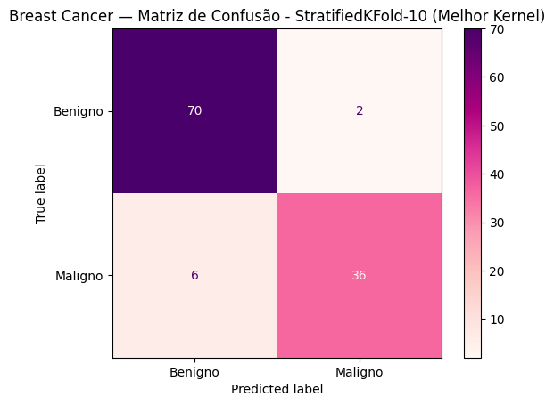

# Introdução
Este projeto tem como objetivo investigar a performance do classificador **SVM (Support Vector Machine)** aplicado ao conjunto de dados **Breast Cancer Wisconsin**. A análise concentra-se no efeito das estratégias de validação cruzada estratificada sobre as estimativas de desempenho, comparando dois esquemas: **StratifiedKFold com K=10** e **StratifiedKFold com K=12**. O foco é verificar se a escolha do número de dobras altera de maneira significativa métricas como acurácia média e composição da matriz de confusão.

O conjunto de dados utilizado possui **569 amostras e 30 atributos numéricos**, e foi obtido do repositório público Kaggle. No fluxo experimental, os dados foram pré-processados, incluindo a remoção de colunas não informativas e a codificação dos rótulos em formato binário, divididos em treino/teste com partição estratificada (80/20) e submetidos a ajuste de hiperparâmetros via **GridSearchCV** para combinações de **kernel**, **C** e **gamma**. Foram então comparadas as métricas médias obtidas com StratifiedKFold-10 e StratifiedKFold-12, registrando-se tanto as acurácias médias quanto as matrizes de confusão correspondentes.

* Investigar a performance do classificador SVM aplicado ao conjunto de dados Breast Cancer Wisconsin.
* Comparar diferentes estratégias de validação cruzada estratificada, avaliando o impacto do número de dobras (K=10 versus K=12) sobre as métricas de desempenho.
* Ajustar hiperparâmetros do modelo SVM (kernel, C e gamma) utilizando GridSearchCV para identificar combinações mais eficazes.
* Avaliar métricas de classificação como acurácia média, matriz de confusão e ROC-AUC para compreender o comportamento do modelo.
***
## Antes de começar

### Executando este notebook online
Este projeto foi inteiramente desenvolvido no Google Colab.
Mesmo o arquvio ipynb estando neste repositório, recomendamos que você também o execute por lá para reproduzir os resultados de uma maneira mais fiel a nossa experiência.
* <a href="https://colab.research.google.com/drive/1bKBtG230bF6XtyLlrXvE4syhPJkybr-W?usp=sharing" target="_parent"></a>

⚠ _O Colab oferece um ambiente temporário: tudo o que você fizer será excluído depois de um tempo, portanto, certifique-se de salvar todos os dados que lhe interessam._

<details>

Outros serviços que também podem funcionar, mas não foram testados completamente, além de que certas etapas como o upload do dataset não foram documentadas para estes serviços:

* <a href="LINK_KAGGLE"></a>

* <a href="LINK_BINDER"></a>

* <a href="LINK_DEEPNOTE"></a>
</details>

***
## Fluxo de Trabalho do Modelo


#  Organização do Notebook  

## 1. Imports e Configurações Globais  

Utilizamos bibliotecas amplamente conhecidas. Cada uma tem um papel específico no pipeline:  

- **`from sklearn.model_selection import train_test_split, StratifiedKFold, cross_val_score, GridSearchCV`**  
  - `train_test_split`: realiza a divisão do conjunto de dados em treino e teste.  
  - `StratifiedKFold`: cria partições estratificadas para validação cruzada, mantendo a proporção das classes em cada fold.  
  - `cross_val_score`: executa validação cruzada de maneira simplificada para avaliação rápida.  
  - `GridSearchCV`: faz busca exaustiva em uma grade de hiperparâmetros, avaliando cada combinação por validação cruzada.  

- **`from sklearn.svm import SVC`**  
  - Importa o modelo de máquina de vetores de suporte para classificação (Support Vector Classifier).  

- **`from sklearn.metrics import accuracy_score, ConfusionMatrixDisplay`**  
  - `accuracy_score`: calcula a acurácia do modelo (proporção de acertos).  
  - `ConfusionMatrixDisplay`: exibe visualmente a matriz de confusão para facilitar a interpretação dos erros.  

- **`import pandas as pd`**  
  - Biblioteca para manipulação e análise de dados em estruturas como DataFrames.  

- **`import numpy as np`**  
  - Suporte para operações numéricas vetorizadas e manipulação de arrays.  

- **`import matplotlib.pyplot as plt`**  
  - Ferramenta para criação de gráficos e visualizações básicas.   

- **`%matplotlib inline`**  
  - Comando que faz com que os gráficos do Matplotlib sejam exibidos dentro do notebook.  

Além dos imports, são definidas variáveis globais para manter consistência ao longo de todo o notebook.  
A variável **`scale = 0`** foi configurada para facilitar a definição dos valores de `gamma` durante os testes.  
A constante **`RANDOM_STATE = 42`** garante reprodutibilidade dos resultados, fixando a semente do gerador aleatório.  
Por fim, são instanciados dois objetos de validação cruzada estratificada: **`cv_KFold10`** e **`cv_KFold12`**, que criam partições estratificadas em 10 e 12 folds, respectivamente, permitindo comparar o impacto do número de dobras na avaliação do modelo.  
 
## 2. Upload e Visualização Inicial do Dataset  

Este projeto utiliza o dataset *Breast Cancer Wisconsin*.  
No Google Colab, é possível carregar o arquivo CSV diretamente do seu computador, o dataset está presente neste reposítorio.  

1. Clique no ícone de pasta no painel lateral do Colab.  

2. Clique em “Upload” e selecione o arquivo `Breast_Cancer_Wisconsin.csv` do seu computador.   

3. Após o upload, o arquivo aparecerá na lista de arquivos disponíveis.  
  

Depois disso, execute o bloco abaixo para ler o arquivo e visualizar as primeiras linhas:  

```python
bc = pd.read_csv('Breast_Cancer_Wisconsin.csv')
bc.head()
```
## 3. Tratamento do Dataset  

Antes do pré-processamento, algumas colunas não relevantes foram removidas para garantir que o modelo trabalhasse apenas com os **30 atributos numéricos significativos**.  

- **`id`**: identificador do paciente, não influencia no diagnóstico.  
- **`Unnamed: 32`**: coluna vazia (resíduo do CSV).  

Essa limpeza evita que informações irrelevantes ou nulas interfiram no treinamento do modelo.  

> *Exemplo de código:*  
> ```python
> bc.drop(['Unnamed: 32','id'], axis=1, inplace=True)
> ```

---
## 4. Pré-processamento de Dados (Parte 1)  

Em seguida, os dados foram organizados em:  

- **`X`**: todos os atributos numéricos (variáveis independentes).  
- **`y`**: coluna `diagnosis`, contendo os rótulos **Maligno (M)** ou **Benigno (B)** (variável-alvo).  

Separar atributos e alvo é essencial para alimentar corretamente os algoritmos de aprendizado.  

> *Exemplo de código:*  
> ```python
> X = bc.loc[:, bc.columns != "diagnosis"]
> y = bc.loc[:, "diagnosis"]
> ```

---
## 5. Pré-processamento de Dados (Parte 2 – Divisão do Treino)  

O conjunto de dados foi dividido em **80% para treino** e **20% para teste** usando `train_test_split` com o parâmetro `stratify=y`.  
A estratificação garante que a proporção entre classes (M e B) seja mantida em ambos os conjuntos, evitando que um deles fique desbalanceado.  

Como os rótulos estavam em formato de string, foi usado `pd.factorize()` para convertê-los em inteiros (0 e 1), facilitando o uso de funções como `np.bincount` e garantindo compatibilidade com algoritmos de aprendizado.  

Ao final desta etapa, são exibidas:  
- **As dimensões de treino e teste** (quantidade de amostras e atributos).  
- **A distribuição das classes** em cada conjunto, validando que a separação representativa foi respeitada.  

> *Exemplo de código resumido:*  
> ```python
> X_train, X_test, y_train, y_test = train_test_split(
>     X, y, test_size=0.2, random_state=RANDOM_STATE, stratify=y)
>
> y_train_num, _ = pd.factorize(y_train)
> y_test_num, _ = pd.factorize(y_test)
> ```

## 6. Processamento de Dados  

Após o pré-processamento (limpeza, codificação e divisão treino/teste), os dados já se encontram no formato adequado para serem utilizados pelo modelo SVM.  
Não foi necessário aplicar transformações adicionais nesta etapa; assim, seguimos diretamente para o treinamento do classificador.
  
## 7. Treino de Dados com Kernel Linear  

Nesta etapa, treinamos o modelo **SVM** utilizando **kernel linear**.  
O kernel linear busca encontrar um **hiperplano que melhor separa as classes** (benigno e maligno) maximizando a margem entre elas.  

- **Treinamento:** o modelo recebe os dados `X_train` e `y_train` e ajusta os parâmetros para encontrar o hiperplano ótimo.  
- **Predição:** após treinado, aplicamos `model.predict(X_test)` para prever os rótulos das amostras de teste.  
- **Avaliação:** comparamos `y_pred` com `y_test` para calcular a **acurácia** e visualizamos a **matriz de confusão**, que detalha:
  - Verdadeiros positivos (maligno corretamente detectado)  
  - Verdadeiros negativos (benigno corretamente detectado)  
  - Falsos positivos (benigno classificado como maligno)  
  - Falsos negativos (maligno classificado como benigno)  

Esse detalhamento é importante em contextos médicos, pois nem todos os erros têm o mesmo impacto.  

Além da acurácia, também exibimos:
- As **10 primeiras previsões** comparadas aos rótulos reais.
- A **matriz de confusão**, que mostra a qualidade da classificação em cada classe.

*[Breast Cancer] Linear — **Acurácia: 92.11%***

 

* **Preditos (10):** ['B' 'M' 'B' 'B' 'M' 'B' 'B' 'B' 'B' 'B']
* **Reais (10):** ['B' 'M' 'B' 'M' 'B' 'B' 'M' 'B' 'B' 'B']

## 8. Treino de Dados com Kernel Não-linear (RBF)  

Nesta etapa, treinamos um **SVM com kernel RBF (Radial Basis Function)**.  
Diferente do kernel linear, o RBF consegue capturar relações **não-lineares** entre os atributos, permitindo separar classes que não são perfeitamente divididas por um único hiperplano.  
Essa flexibilidade torna o kernel RBF indicado para **cenários mais complexos**, em que as fronteiras de decisão são curvas ou não-lineares.

O fluxo é o mesmo utilizado no modelo linear:

1. **Treinamento:** o modelo recebe `X_train` e `y_train` e ajusta os parâmetros para criar uma superfície de decisão não-linear.  
2. **Predição:** aplicamos `model.predict(X_test)` para prever os rótulos das amostras de teste.  
3. **Avaliação:** comparamos `y_pred` com `y_test` para calcular a **acurácia**.  
4. **Matriz de Confusão:** visualizamos os resultados para entender onde o modelo acerta e erra:  
   - Verdadeiros positivos (maligno corretamente detectado)  
   - Verdadeiros negativos (benigno corretamente detectado)  
   - Falsos positivos (benigno classificado como maligno)  
   - Falsos negativos (maligno classificado como benigno)

Essa análise ajuda a compreender como o uso de um kernel não-linear influencia o desempenho do classificador SVM no diagnóstico do câncer de mama.

*[Breast Cancer] RBF — **Acurácia: 90.35%***


* **Preditos (10):** ['B' 'M' 'B' 'B' 'B' 'B' 'B' 'B' 'B' 'B']
* **Reais (10):** ['B' 'M' 'B' 'M' 'B' 'B' 'M' 'B' 'B' 'B']

## 9. StratifiedKFold (K=10) com GridSearchCV – Apenas Kernel (SKF-10)  

Nesta etapa aplicamos **validação cruzada estratificada com 10 dobras (folds)** para avaliar diferentes kernels do SVM e escolher aquele com melhor desempenho médio.  
O objetivo aqui é **testar apenas o parâmetro `kernel`** sem mexer nos demais hiperparâmetros (C e gamma), isolando o impacto da escolha do kernel.

Fluxo da etapa:

1. **Definição do modelo:** utilizamos `SVC(random_state=RANDOM_STATE)` como modelo base.  
2. **Parâmetros testados:** `kernel` em `['linear', 'rbf', 'poly', 'sigmoid']`.  
3. **Validação cruzada estratificada:** cada kernel é avaliado em **10 dobras**, preservando a proporção entre as classes benigno e maligno em cada partição.  
4. **Escolha do melhor kernel:** o **GridSearchCV** seleciona automaticamente o kernel com maior média de acurácia nas dobras.  
5. **Predição e avaliação final:** aplicamos o kernel selecionado ao conjunto de teste, calculamos a **acurácia** e geramos a **matriz de confusão** para entender os acertos e erros do modelo.

Essa etapa mostra como a simples variação do kernel pode alterar o desempenho do SVM no diagnóstico de câncer de mama.

**[Breast Cancer] Melhor kernel (Grid kernel):** linear
* **Acurácia teste (melhor kernel):** 92.11%
 



## 10. StratifiedKFold (K=10) com GridSearchCV – Kernel, C e Gamma (SKF-10)  

Nesta etapa expandimos a busca para incluir não apenas o **kernel**, mas também os hiperparâmetros **C** e **gamma**, tornando a otimização mais completa.  
O objetivo é encontrar a combinação mais eficaz entre os três parâmetros utilizando **validação cruzada estratificada com 10 dobras (SKF-10)**.

Fluxo da etapa:

1. **Definição do modelo:** `SVC(random_state=RANDOM_STATE)` como base.  
2. **Parâmetros testados:**  
   - `kernel`: define o tipo de fronteira de decisão (`linear`, `rbf`, `poly`, `sigmoid`).  
   - `C`: parâmetro de regularização; controla o **trade-off** entre margem mais ampla e penalização de erros.  
   - `gamma`: controla a **curvatura** da fronteira de decisão para kernels não-lineares.  
3. **Validação cruzada estratificada:** cada combinação é avaliada em **10 dobras**, mantendo a proporção entre classes benigno/maligno.  
4. **Seleção da melhor combinação:** o GridSearchCV retorna automaticamente o conjunto de parâmetros com maior média de acurácia nas dobras.  
5. **Predição e avaliação final:** aplicamos os melhores parâmetros no conjunto de teste, calculamos a **acurácia** e geramos a **matriz de confusão** para detalhar os acertos e erros do modelo.

Essa etapa demonstra como ajustes simultâneos em kernel, C e gamma podem melhorar significativamente o desempenho do SVM.

 

## 11. Varredura de Parâmetros (C e Gamma) – SKF-10  

Nesta etapa realizamos uma **análise sistemática dos hiperparâmetros** do SVM para entender seu impacto no desempenho do modelo, usando **validação cruzada estratificada de 10 dobras (SKF-10)**.

### 11.1 Variação de C no Kernel Linear  
Primeiro investigamos o efeito do parâmetro **C** em um **SVM linear**:  

- **C (regularização):** controla o balanço entre:
  - **Margem mais ampla com tolerância a erros** (C pequeno).  
  - **Margem mais estreita com penalização mais rígida de erros** (C grande).  

Para cada valor de C em `[0.01, 0.1, 1, 10, 100]`:  
1. Criamos um modelo `SVC(kernel='linear', C=C)`.  
2. Avaliamos o modelo com **validação cruzada estratificada de 10 dobras**, preservando a proporção de classes benigno/maligno em cada dobra.  
3. Calculamos a **média das acurácias** obtidas nas dobras.  

Esse teste mostra como a regularização afeta o equilíbrio entre **simplicidade do modelo** e **adaptação aos dados de treino**.

---

### 11.2 Variação de C e Gamma no Kernel RBF  
Em seguida, analisamos a combinação dos parâmetros **C** e **gamma** no **SVM com kernel RBF**:  

- **C (regularização):** mesmo papel descrito acima.  
- **Gamma:** define a influência de cada ponto de treino na fronteira de decisão:  
  - **Gamma alto** → o modelo “segue” mais de perto os pontos de treino (fronteira mais detalhada/irregular).  
  - **Gamma baixo** → o modelo considera o conjunto de forma mais geral (fronteira mais suave/regular).  

Para cada combinação de C e gamma:  
1. Criamos um `SVC(kernel='rbf', C=C, gamma=gamma)`.  
2. Avaliamos o modelo com **validação cruzada estratificada de 10 dobras**.  
3. Calculamos a **média das acurácias** obtidas.  

Esse procedimento ajuda a visualizar **como o ajuste simultâneo de C e gamma influencia a capacidade do SVM RBF de generalizar**.


## 12. StratifiedKFold (K=12) com GridSearchCV – Apenas Kernel (SKF-12)

Nesta etapa repetimos a busca pelo **melhor kernel**, agora utilizando **validação cruzada estratificada de 12 dobras (SKF-12)**.  
O objetivo é verificar se **aumentar o número de partições** impacta a escolha do kernel ou melhora a estabilidade das métricas obtidas.

**Resumo:**

- **Objetivo:** avaliar se alterar o número de dobras (de 10 para 12) muda os resultados do GridSearch.  
- **Modelo base:** `SVC(random_state=RANDOM_STATE)`  
- **Kernels testados:** `linear`, `rbf`, `poly` e `sigmoid`  
- **Validação cruzada:** cada kernel é avaliado em **12 dobras**, preservando a proporção de classes benigno/maligno.  

**Avaliação após encontrar o melhor kernel:**

- **Acurácia:** proporção de classificações corretas no teste.  
- **Matriz de confusão:** detalha verdadeiros positivos/negativos e erros, permitindo comparar o desempenho entre **K=10** e **K=12**.  

---

## 13. StratifiedKFold (K=12) com GridSearchCV – Kernel, C e Gamma (SKF-12)

Nesta etapa aplicamos um **GridSearch completo**, agora utilizando **validação cruzada estratificada de 12 dobras (SKF-12)** para identificar a **melhor combinação de parâmetros** para o SVM.  
O objetivo é avaliar se o **aumento do número de dobras (de 10 para 12)** altera as combinações ótimas e o desempenho obtido.

**Parâmetros testados:**

- **`kernel`**: define o tipo de fronteira de decisão (`linear`, `rbf`, `poly`, `sigmoid`)  
- **`C`**: parâmetro de regularização, controla o **trade-off entre margem ampla e penalização de erros**  
- **`gamma`**: influencia a **curvatura da fronteira de decisão** para kernels não-lineares  

**Processo:**

- Cada combinação de **kernel**, **C** e **gamma** é avaliada em **12 dobras**, preservando a proporção de classes benigno/maligno em cada partição.  
- O **GridSearchCV** identifica a **melhor combinação de parâmetros** com base na acurácia média das dobras.  
- O modelo ajustado com essa combinação é aplicado ao conjunto de teste.  

**Avaliação:**

- **Acurácia no teste:** proporção de classificações corretas.  
- **Matriz de confusão:** mostra a qualidade das previsões (verdadeiros positivos/negativos e erros), permitindo comparar resultados com o cenário **K=10**.  


## 14. Varredura de Parâmetros – StratifiedKFold (K=12)

Por fim, realizamos uma **varredura sistemática dos parâmetros** utilizando **validação cruzada estratificada de 12 dobras (SKF-12)**, consolidando os resultados para análise final.  
O foco é observar como a variação dos hiperparâmetros impacta o desempenho do modelo.

**Parâmetro avaliado:**

- **`C` (regularização):** controla o equilíbrio entre:
  - **Margem ampla e tolerância a erros** (C pequeno)  
  - **Margem estreita e penalização de erros** (C grande)

**Processo:**

1. Para cada valor de `C` em `[0.01, 0.1, 1, 10, 100]`:  
   - Criamos um **SVM linear** com o valor atual de `C`.  
   - Avaliamos o modelo usando **validação cruzada estratificada de 12 dobras**, preservando a proporção de classes benigno/maligno.  
2. Calculamos a **média das acurácias** obtidas nas 12 dobras para cada valor de `C`.  

**Objetivo final:**

- Visualizar e comparar o impacto dos diferentes valores de `C` sobre a performance do modelo.  
- Consolidar os resultados para compreender melhor como a regularização influencia a classificação no contexto do Breast Cancer Wisconsin Dataset.  
